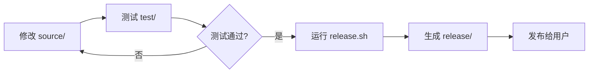

# CCNUthesis 项目架构分析报告

> **更新日期**: 2025-08-08  
> **项目版本**: v1.4.6 (开发者维护版)  
> **架构版本**: 2.0 (开发者中心架构)

## 📋 项目概览

CCNUthesis 是华中师范大学数学与统计学学院的学位论文 LaTeX 模板，支持本科、硕士、博士三种学位类型的论文写作。项目基于现代 LaTeX 技术构建，使用 LaTeX3 编程语言开发，提供了简洁的用户接口和规范的格式控制。

**项目特点**:
- 🎯 **多学位支持**: 本科/硕士/博士论文格式
- 🔧 **现代技术栈**: LaTeX3 + XeTeX
- 🌍 **跨平台兼容**: Windows/macOS/Linux
- 📚 **开发者友好**: 清晰的开发、测试、发布流程

## 🏗️ 开发者中心架构

### 1. 新架构设计理念

```
开发者中心架构 2.0
├── 单一源码原则 (Single Source of Truth)
├── 清晰职责分离 (Separation of Concerns)
├── 自动化工作流 (Automated Workflow)
└── 用户透明发布 (Transparent Release)
```

### 2. 目录结构

```
CCNUthesis/
├── 📁 source/                    # 核心源码（单一事实来源）
│   ├── CCNUthesis.cls           # 主文档类文件
│   ├── gb7714-CCNU.bbx          # 华师顺序编码制样式
│   ├── gb7714-CCNU.cbx          # 华师引用样式
│   └── gb7714-CCNUay.bbx        # 华师作者年制样式
│
├── 📁 test/                      # 测试环境
│   ├── test-basic/               # 基础测试环境
│   │   ├── main.tex             # 测试主文档
│   │   ├── ccnu-setup.tex       # 测试配置
│   │   ├── front/               # 前置内容
│   │   ├── body/                # 正文章节
│   │   └── back/                # 后置内容
│   ├── test-bachelor/            # 本科论文测试
│   ├── test-master/              # 硕士论文测试
│   └── test-doctor/              # 博士论文测试
│
├── 📁 scripts/                   # 构建和自动化脚本
│   ├── build.py                 # Python构建脚本
│   ├── test.sh                  # 测试脚本
│   ├── release.sh               # 发布脚本
│   ├── latexmkrc                # LaTeX构建配置
│   └── vscode-settings/          # VSCode配置
│
├── 📁 release/                   # 发布版本（自动生成）
│   └── CCNUthesis-vX.X.X/       # 用户发布包
│
├── 📁 assets/                    # 静态资源
│   ├── images/                  # 图片资源
│   │   ├── logos/               # 校徽和标识
│   │   └── figures/             # 示例图片
│   └── documents/               # 文档资源
│       └── copyright/           # 版权声明页
│
├── 📁 docs/                      # 完整文档系统
│   ├── user-guide/              # 用户手册
│   ├── developer/               # 开发文档
│   ├── analysis/                # 分析报告
│   ├── wiki/                    # 在线文档
│   ├── references/              # 参考资料
│   └── feedback.md              # 用户反馈
│
├── 📁 typesetting-services/      # 代排服务
│   └── [客户项目和服务文档]
│
├── 📁 legacy/                    # 历史版本归档
│   └── math-old-Deng/           # 邓国泰老师旧版模板
│
└── 📄 项目文件
    ├── README.md                # 项目介绍
    ├── LICENSE                  # 许可证
    └── CHANGELOG.md             # 版本记录
```

## 🔄 开发工作流

### 1. 开发流程



### 2. 路径管理策略

#### 开发时路径
- 从 `test/` 引用 `source/`: `../../source/CCNUthesis`
- 从 `source/` 引用 `assets/`: `../../assets/`

#### 发布时路径
- 文档类: `CCNUthesis` (同目录)
- 资源: `logo/`, `figures/`, `copyright/` (子目录)

### 3. 自动化脚本

```bash
# 测试所有模板
./scripts/test.sh

# 创建发布版本
./scripts/release.sh 1.4.7

# Python构建
python scripts/build.py
```

## 🔬 技术架构分析

### 1. LaTeX3 核心技术

**现代编程范式**:
```latex
% LaTeX3 变量系统
\int_new:N    \g__ccnu_thesis_type_int
\bool_new:N   \g__ccnu_blind_version_bool
\str_new:N    \g__ccnu_type_version_str

% 键值配置系统
\keys_define:nn { ccnu } {
  type .choices:nn = { doctor, master, bachelor }
}
```

### 2. 智能版本控制

```latex
% 多版本支持
version = electronic              # 电子版
blind-version = true              # 盲审版
blind-version = remove-schoolname # 去校名版
```

### 3. 参考文献系统

```latex
% 双模式支持
gb7714-CCNU.bbx    # 顺序编码制
gb7714-CCNUay.bbx  # 作者年制
```

## 📐 设计模式

### 1. 单一职责原则 (SRP)
- `source/`: 仅负责核心代码
- `test/`: 仅负责测试验证
- `scripts/`: 仅负责自动化
- `release/`: 仅负责用户分发

### 2. 策略模式 (Strategy Pattern)
不同学位类型的格式策略:
```latex
\int_case:nn \g__ccnu_thesis_type_int
  { {1}{博士} {2}{硕士} {3}{本科} }
```

### 3. 模板方法模式 (Template Method)
统一的文档结构:
```latex
\frontmatter  % 前置部分
\mainmatter   % 正文部分
\backmatter   % 后置部分
```

## 🚀 架构优势

### ✅ 开发效率提升
1. **单一源码位置**: 避免重复和混淆
2. **独立测试环境**: 不影响源码的测试
3. **自动化脚本**: 一键测试和发布
4. **清晰的目录**: 每个文件都有明确位置

### ✅ 维护性改善
1. **模块化结构**: 功能分离，易于维护
2. **版本控制友好**: 清晰的提交历史
3. **文档集中**: 所有文档在 `docs/`
4. **历史归档**: 旧版本在 `legacy/`

### ✅ 用户体验优化
1. **干净的发布包**: 用户只获取必要文件
2. **完整的文档**: 用户手册和示例
3. **稳定的接口**: 向后兼容的配置
4. **跨平台支持**: 全平台编译支持

## 📊 架构对比

| 特性 | 旧架构 | 新架构 2.0 |
|------|--------|------------|
| 源码位置 | 分散多处 | 集中 `source/` |
| 测试环境 | 与源码混合 | 独立 `test/` |
| 构建工具 | 分散多目录 | 统一 `scripts/` |
| 文档管理 | 散乱分布 | 集中 `docs/` |
| 发布流程 | 手动复制 | 自动化脚本 |
| 开发清晰度 | ⭐⭐ | ⭐⭐⭐⭐⭐ |

## ⚡ 快速开始

### 开发者工作流
```bash
# 1. 修改源码
vim source/CCNUthesis.cls

# 2. 测试修改
cd test/test-basic/
xelatex main.tex

# 3. 运行测试套件
./scripts/test.sh

# 4. 创建发布
./scripts/release.sh 1.4.7
```

### 关键命令
```bash
# 清理编译文件
latexmk -c

# 完整编译
latexmk -xelatex main.tex

# 查看日志
grep -n "Error" main.log
```

## 🔮 未来发展方向

### 技术演进
1. **容器化**: Docker环境一键部署
2. **CI/CD**: GitHub Actions自动测试
3. **Web编译**: 在线编译服务
4. **插件生态**: VSCode/Vim深度集成

### 功能扩展
1. **模板市场**: 更多学院模板
2. **格式检查**: 自动化格式验证
3. **AI辅助**: 智能写作建议
4. **云端同步**: 多设备协作

## 🎯 总结

新的开发者中心架构(2.0)成功解决了原有的"开发文档和辅助文件全在一个目录，文档太乱"的核心问题，通过：

- **单一源码原则**: 确保代码的唯一性和权威性
- **清晰职责分离**: 开发、测试、发布各司其职
- **自动化工作流**: 减少手动操作，提高效率
- **开发者友好**: 清晰的目录结构和工作流程

这一架构重组为 CCNUthesis 的持续发展奠定了坚实基础，使其成为一个真正现代化、工程化的 LaTeX 模板项目。

---

**🔖 文档信息**  
- **创建时间**: 2025-08-07
- **更新时间**: 2025-08-08  
- **架构版本**: 2.0 (开发者中心架构)
- **适用场景**: 开发指导、架构参考、项目维护

---

*本文档反映了 CCNUthesis 项目经过架构重组后的最新状态，展示了从用户混合模式到开发者中心模式的转变。*