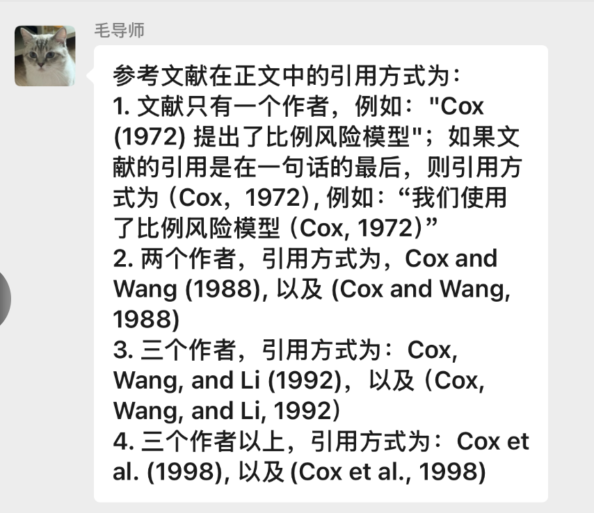

# 姜煜

| 标签        | 数学         |
| --------- | ---------- |
| 专业        | 应用统计       |
| 预计代排的截止日期 | 2025/04/06 |
| 价格        | ¥420.00    |
| 定金        | ¥200.00    |
| 尾款        | ☐          |
| 你想了解什么？   |            |

[华师硕士论文.doc](file/华师硕士论文_HGOptxOKS6.doc "华师硕士论文.doc")

[Generalizing the Intention-to-Treat Effect of an Active Control from Historical Placebo-Controlled Trials  A Case Study of the Efficacy of Daily Oral .pdf](<file/Generalizing the Intention-to-Treat Effect of an A.pdf> "Generalizing the Intention-to-Treat Effect of an Active Control from Historical Placebo-Controlled Trials  A Case Study of the Efficacy of Daily Oral .pdf")
