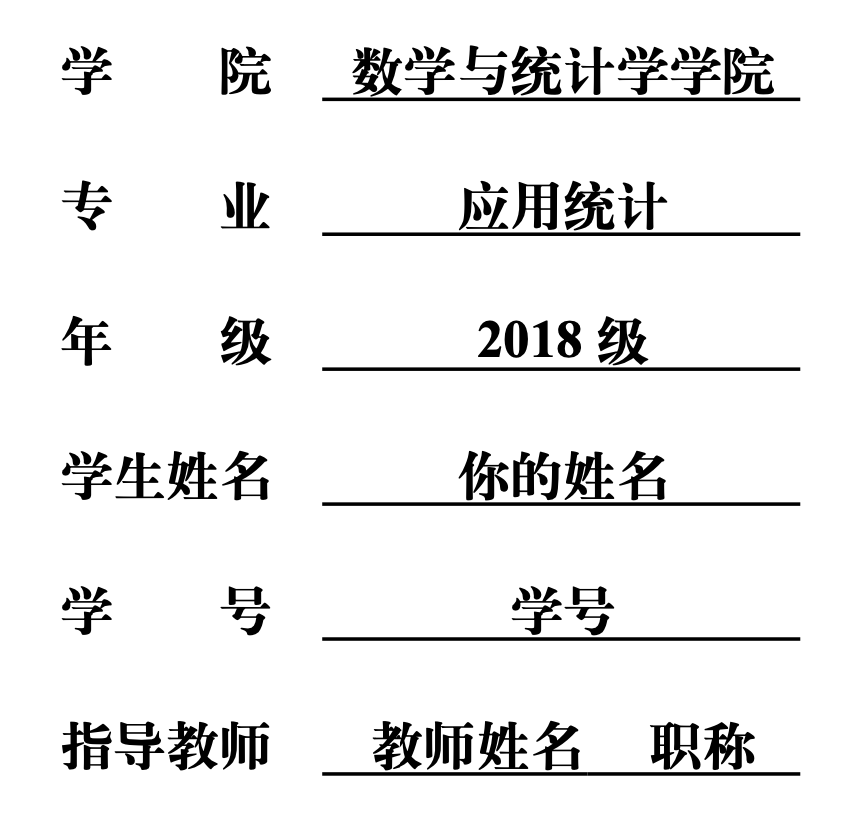
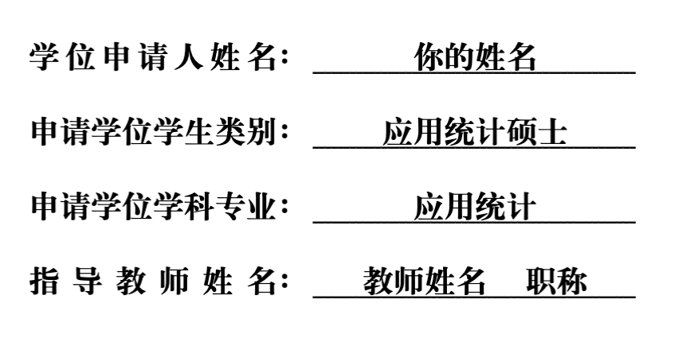
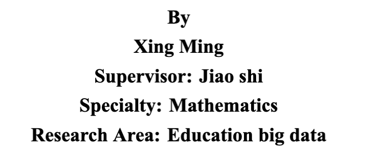
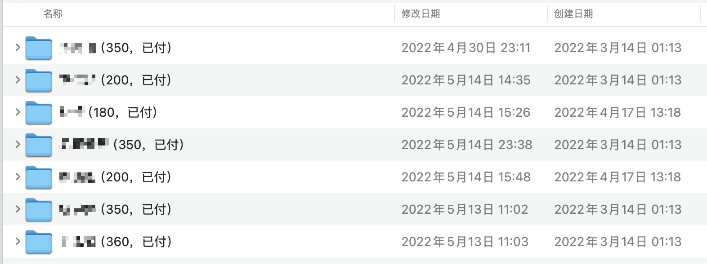

# CCNUthesis 代排需知

## 目录

- [代排包含的服务](#代排包含的服务)
  - [初排](#初排)
  - [修改](#修改)
  - [答辩前修改](#答辩前修改)
  - [答辩后修改](#答辩后修改)
- [需要你提供的内容](#需要你提供的内容)
  - [Tips](#Tips)
- [你需要做什么](#你需要做什么)
- [收费情况](#收费情况)
- [最后](#最后)

感谢填写问卷！如果你不想学习 LaTeX，也不想安装这安装那的，欢迎找我代排～

## 代排包含的服务

### 初排

### 修改

### 答辩前修改

### 答辩后修改

## 需要你提供的内容

> 其实你知道代排本身是在做什么，就知道要提供什么啦～
> 代排本质上就是**复刻**你的内容，我不对你里面的内容本身做任何修改删减这个你放心，你提供的内容本身是什么样，就是什么样。
> 代排的工作就是把你提供的论文内容，通过 LaTeX 以及 CCNUthesis 模版排版出符合规范的论文。

需要你提供一个包含你论文信息的完整 word 文件，学院年级群一般会发教务处的规范的 word 模版，其实不用那个也没啥问题，你的 word 要包含下面的信息

- 基本信息
  - 本科

    
    - 中文标题
  - 硕博

    

    
    - 中文标题
    - 英文标题
    - 学院的中文名称和英文名称
      - 数学学院的不需要提供，默认就是数院的
- 中英文摘要
- 中英文关键词
- 正文内容
  - 利用 word 的章节标题来区分章节，或者你可以手动编号，比如
    1.1
    1.1.1
    让我能知道有不同的章节区分即可
- 参考文献
  > 📌请找自己的论文指导老师问清楚：引用样式和参考文献样式
  > 主要有两种：顺序编码制和作者年制

> 📌如果年级群、指导老师等有发一些额外的格式要求，请提前说明！

### Tips

- 如果有一些公式你是从书上找的，但你又不想打，甚至不想用 word 打，你可以考虑下面的方法
  - 直接截图、拍照等，然后插图
  - 通过 simpletex或者一些 AI工具 OCR 成 LaTeX 代码

## 你需要做什么

除了提供上述资料外，我排完初稿后会发给你检查内容。

## 收费情况

> 📌总体的原则：综合你的内容难度和需要我多久排完

我先了解一下你的基本信息才能大致判断一下所需的精力和时间，再通过进一步了解来确定最终价格哈～

这是往届的同学找我代排的大概费用：

费用区间在 200-500 左右， 具体还是要根据你的论文word内容中

- 文字
- 图、表
- 公式
- 参考文献&#x20;

等内容难易多少以进行判断。

## 最后

有什么问题都可以尽管提问～本页面的链接为：[https://www.wolai.com/xdyy/jwrrwqvyGW2byzraMLyrfC](https://www.wolai.com/xdyy/jwrrwqvyGW2byzraMLyrfC "https://www.wolai.com/xdyy/jwrrwqvyGW2byzraMLyrfC")，可以保存下来随时查看

我的联系方式：

- QQ：617315571
- 微信：xiakangwei001
